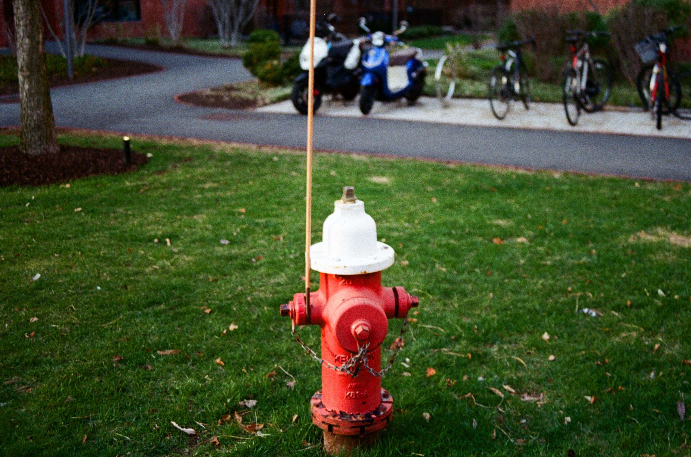
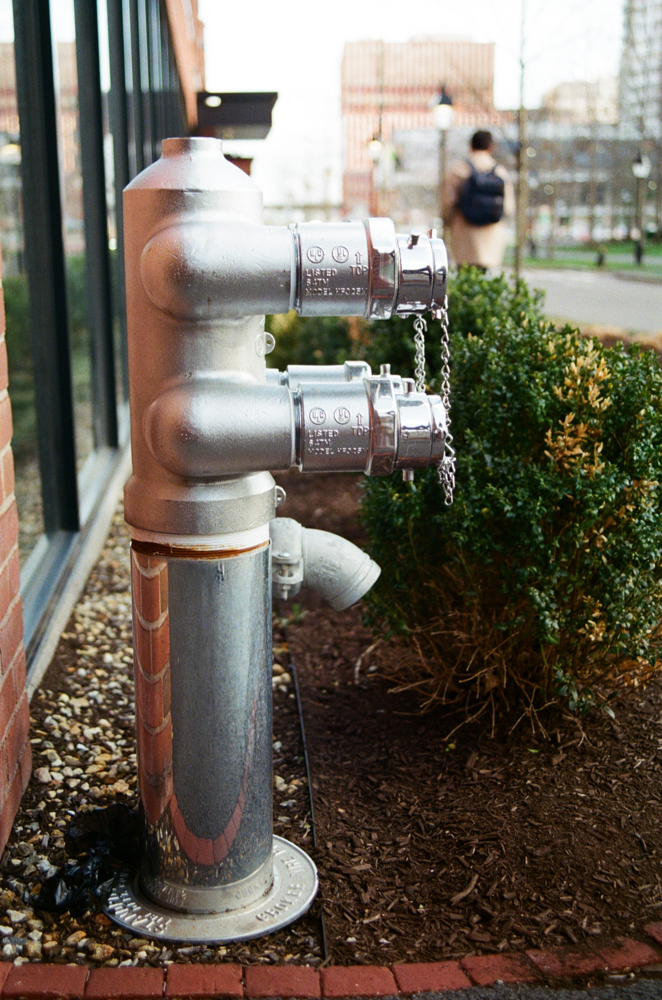
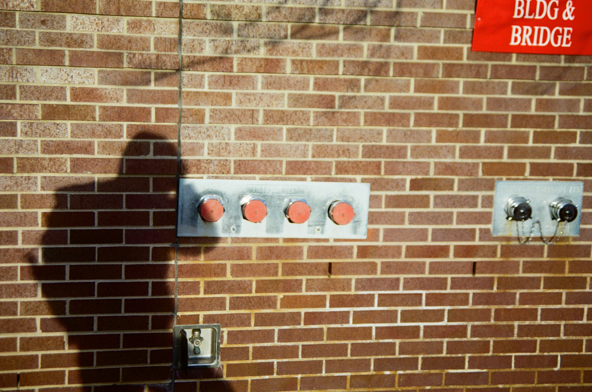

# Retraining the Gaze  
**Hydrants@Charles River in 35mm Films**

> *An Object We All Trained On*  
> *Before Cats, There Was Fire Hydrant*  
> *oid/m/01pns0 & coco-11: Portraits*

---

Shot on 35mm film near Harvard, this series revisits a forgotten icon of early computer vision — not as data, but as presence.

Once, the fire hydrant stood at the frontier of machine perception: a geometric constant, bold in form, universally recognizable. These red, yellow, rusted sentinels taught early models to see — not with imagination, but with recognition.

This project turns the lens around.

Wandering the streets by the Charles River, I photographed fire hydrants on 35mm film, embracing the slow cadence of analog. Each hydrant reveals its own posture, patina, and context — a quiet architecture shaped by both utility and neglect.

What was once a bounding box is now a portrait.

---

## 📷 Project Contents
- `README.md` – You’re reading it
- `/images/` – Digitized 35mm scans of 36 hydrants, in JPEG
- `/metadata/` – To be added after the second roll finds its way through the camera :)

---

## 💡 Why Hydrants?

Fire hydrants are among the most frequently labeled objects in early object detection datasets like COCO (category ID `11`) and Open Images (class `/m/01pns0`). (Do you know why early vision folks used hydrants for camera calibration?)  

With their bold shapes, fixed positions, and street-corner ubiquity, they offered the perfect subject for machine vision’s formative years — simple, reliable, and everywhere. Before deep networks turned to cats, faces, or dreams, the hydrant stood as a quiet constant.  

This project revisits that role — not as annotation, but as presence; not as data, but as infrastructure made visible.

---

## 🛠️ Technical Notes
- Camera: Canon AE-1  
- Lens: Sigma 35-70mm F2.8-4
- Film: FUJIFILM 400 Color Negative
- Scanner: idk, Hunt's Photo did it for me  
- Location: Cambridge, MA (near Harvard & Charles River)  

---

## 📜 License
All images and text are © 2025 Leslie Gu.  
For non-commercial use only. Contact for other usage.

---

## 🔗 Related
- [Common Objects in Context dataset (COCO) - Class 11](https://cocodataset.org/#home)  
- [Open Images Dataset (OID) - Class: `/m/01pns0`](https://storage.googleapis.com/openimages/web/index.html#/entity/m/01pns0)  
---
###  Lens to hydrant. Frame to frame. 
